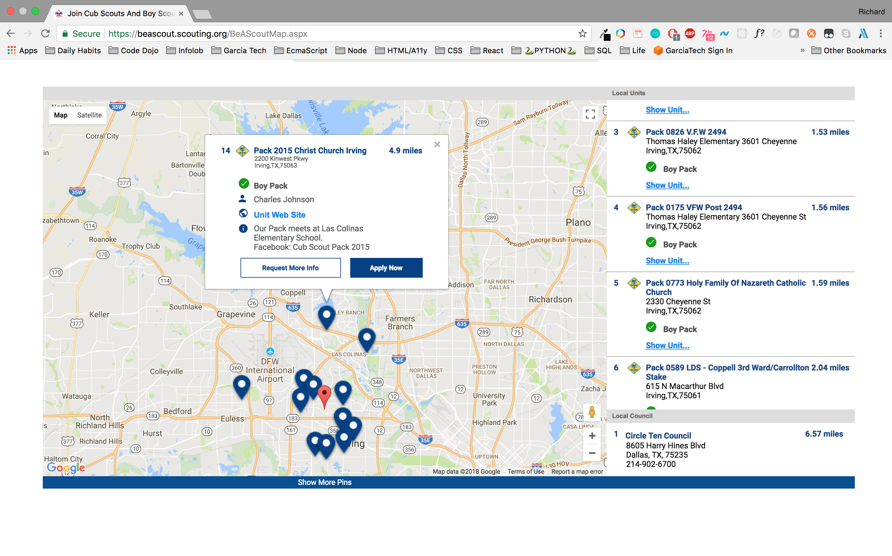

# User Creation Flow

### Objectives
- To determine the flow for creating a user through the medium of my.scouting
- To determine the APIs needed to address the concerns raised from the legacy my.scouting 
application
- To agree on the flow for creating a user before implementation
- To determine the best user experience for the user as this could be their first impression of 
the application and organization

## User Flow
At the time of authoring, there are three routes to create a user presence on the 
respective databases associated with `my.scouting`.
#### Route One: Navigating through `beascout.scouting.org`
A user can visit the [BeAScout](https://beascout.scouting.org/BeAScoutMap.aspx) site and choose
a unit within their area (example shown below), if a unit is accepting applications and has 
properly modified it's settings, an `Apply Now` button will appear on it's flag on the maps provided 
by Google maps. If a link is clicked to _Apply_, the user will be sent to `my.scouting.org` that 
will have a modified URL with a `Record Locator` as query: `https://my.scouting.org/VES/OnlineReg/1.0.0/?tu=UF-MB-571paa2015`. 
The Record Locator is used to connect the account to be created with the specified unit selected from the map (example shown below).
From this point, the flow will transition to the [Second Route](#route-two:anonymously-visiting-my.scouting.org);
 
 

 
 

#### Route Two: Anonymously visiting my.scouting.org
A user can visit the legacy version of [my.scouting.org](https://my.scouting.org) and create a 
presence in the my.scouting databases without any interaction from the Boy Scouts of America or it's affiliates.
