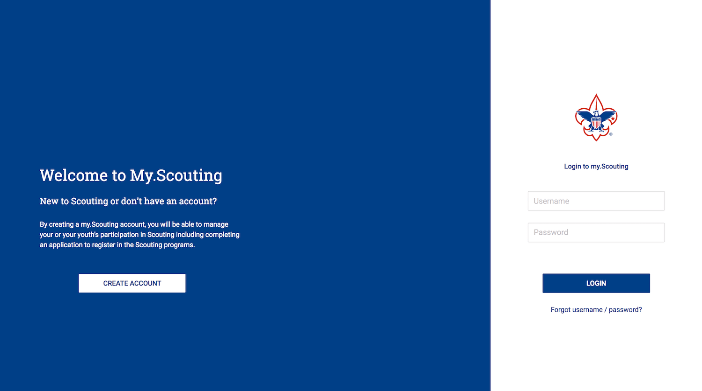

<h1>User Creation Flow</h1>

<h3>Objectives</h3>

<ul>
    <li> To determine the flow for creating a user through the medium of my.scouting</li>
    <li> To determine the APIs needed to address the concerns raised from the legacy my.scouting application</li> 
    <li> To agree on the flow for creating a user before implementation</li>
    <li> To determine the best user experience for the user as this could be their first impression of the application and organization</li> 
</ul>

<h2>User Flow</h2>

    At the time of authoring, there are three routes to create a user presence on the 
    respective databases associated with <code>my.scouting</code>.

<h4>
    Route One: Navigating through <code>beascout.scouting.org</code>
</h4>

    A user can visit the <a href="https://beascout.scouting.org/BeAScoutMap.aspx">BeaScout</a> site 
    and choose
    a unit within their area (example shown below), if a unit is accepting applications and has 
    properly modified it's settings, an <strong>Apply Now</strong> button will appear on it's flag 
    on the map provided by Google maps. If a link is clicked to <em>Apply</em>, the user will be 
    sent to <strong>my.scouting.org</strong> that will have a modified URL with a <strong>Record 
    Identifier</strong> as query: 

<code>https://my.scouting.org/VES/OnlineReg/1.0.0/?tu=UF-MB-571paa2015</code>.

    The <strong>Record Identifier</strong> being <code>UF-MB-571paa2015</code>. 
    The Record Identifier is used to connect the account to be created with the specified unit 
    selected from the map (example shown below). From this point, the flow will be similar to the
    <a href='#route-two-anonymously-visiting-myscoutingorg'>Second Route</a>

 
 

 
 

<h4> Route Two: Visiting my.scouting.org</h4>

    A user can visit the legacy version of <a href="https://my.scouting.org">my.scouting.org</a> and 
    create a presence in the my.scouting databases without any interaction from the Boy Scouts of America or it's affiliates.
    With the latest iteration of <strong>my.scouting.org</strong>, a user will also have the ability to 
    create an account without interaction from BSA, and without a unit/organization specifically chosen.

    Upon clicking on the <strong>Create Account</strong> button, a user will be directed to the 
    <strong>Account Creation</strong> page in <strong>my.scouting.org</strong> shown below.

<h4>Two possibilities:</h4>

<ul>
    <li> 
        <h5>Does not have a Record Identifier</h5>
        

            If the user is arriving to this page <em>without</em> an invitation or 
            without going through <code>beascout.scouting.org</code>, then the full URL will be: 
            <code>my.scouting.org/online-registration/create-account/new</code>.
        

    </li>
    <li>
        <h5>Has a Record Identifier</h5>
        

            If the user is arriving to this page via an invitation (discussed in 
            <a href="#route-three-visiting-myscoutingorg-via-invitation">Route Three</a> or by going through 
            <strong>beascout.scouting.org</strong>, then the full URL will be:
        

        <code>my.scouting.org/online-registration/create-account/{RecordIdentifier}</code>
        

            <strong>Record Identifier</strong> in the URL would be a unique identifier that will be 
            used to link the to-be-made-account with the unit that provided the information. The
            <strong>Record Identifier</strong> will be used to map the user's information to the 
            respective unit/organization.
        

    </li>
</ul>

<h4>Route Three: Visiting my.scouting.org via Invitation/QR code/email</h4>

    If the user is provided with a URL via an invitation/QR code/email, they will be directed to the
    above page with a route similar to: 
     
    <code>my.scouting.org/online-registration/create-account/{RecordIdentifier}</code>
     
    The flow will then be consistent for each of the previously described scenarios in regard to 
    creating a user account.

    
<h2>Creating a user account</h2>

    Upon entry to the <strong>Create Account Page</strong>, the user will see the view above.
    The fields that will be required to advance to the next grouping of questions will be 
    <strong>Date of Birth</strong>, <strong>First Name</strong>, <strong>Last Name</strong>, 
    <strong>Zip Code</strong>. Because a person without an account or presence within our database, 
    the <strong>Member ID</strong> field will not be required. 

 
    The general actions and responses should be taken as the user fills out the <strong>YOUR 
    INFORMATION</strong> form for each field:
    <ul>
        <li>
            <h4>Member ID and Date of Birth fields</h4>
            

                If a user has a <strong>Member ID</strong> but is lacking an account, they can enter 
                their <strong>Member ID</strong>. Entering a person's <strong>Member ID</strong> will
                allow our systems to do a check for account presence in our databases. This action 
                can be invoked with only the <strong>Member ID</strong> or with the coupling of 
                the value of <strong>Date of Birth</strong>. At the time of authoring this, it is 
                understood that both <strong>Member ID</strong> and <strong>Date of Birth</strong> 
                will be used to match a person with their respective account.
            

            

                This action will be fired <strong>ONLY</strong> when the user has fulfilled the 
                following two requirements:
            

            <ol>
                <li>
                    

                        The <strong>Member ID</strong> field has been filled out and passed UI 
                        validation.
                    

                </li>
                <li>
                   

                        The <strong>Date of Birth</strong> field has been filled out and passed UI 
                        validation.
                   

                </li>
            </ol> 
            

                If the above requirements are met, when the user leaves the <strong>Date of 
                Birth</strong> field, an API will be fired. If <strong>Member ID</strong> is 
                missing, the API will not be called. Furthermore, if the actions are done in 
                reverse order (meaning the user fills out the <strong>Date of Birth</strong> 
                field first and then the <strong>Member ID</strong> field), the same action will 
                fire on the blurring (action of losing focus on the field by the user) of the 
                <strong>Date of Birth</strong> field.
            

            

                If the API responds with a match, a modal will open stating the presence of the 
                user's online account. In addition, a message should be provided informing the 
                user of Member Care Services and the respective contact details. with a 
                button that when clicked will send the user to the <a href="##route-two-anonymously-visiting-myscoutingorg">Log In Page</a> 
                
        </li>
        <li>
            <h4>First Name, Last Name, ZIP CODE</h4>
        </li>
    </ul>

